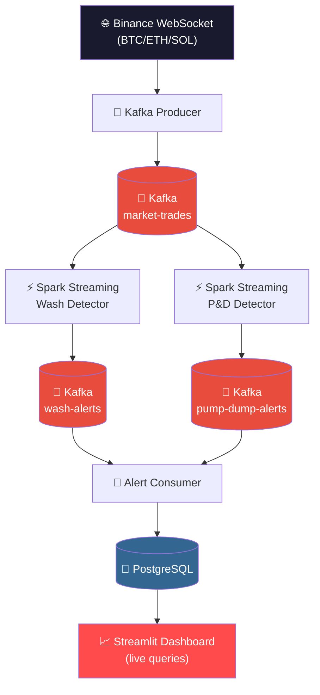
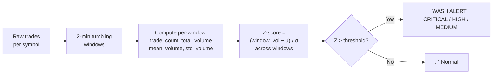
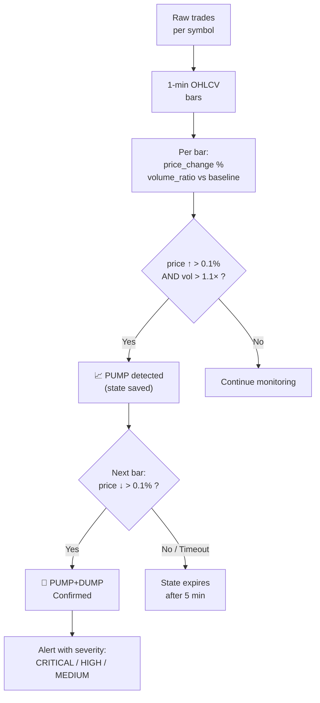

# Market Surveillance for Trade Abuse Detection

A **real-time market surveillance pipeline** that detects manipulative trading patterns — **wash trading** and **pump & dump** schemes — in live cryptocurrency trade data from **Binance**. Built with **Apache Spark Structured Streaming**, **Apache Kafka**, **PostgreSQL**, and **Streamlit**.

> Processes **10,000+ trades per minute** from Binance WebSocket, runs statistical detection algorithms via Spark Structured Streaming, persists alerts to PostgreSQL, and surfaces them on a live-updating dashboard.

[](https://python.org)
[](https://spark.apache.org)
[](https://kafka.apache.org)
[](https://postgresql.org)
[](https://streamlit.io)
[](LICENSE)
[](https://doi.org/10.5281/zenodo.19649591)


---

## What It Detects

| Abuse Type | Description | Detection Method |
|:---|:---|:---|
| **Wash Trading** | Artificially inflating volume by trading with oneself or colluding parties | Statistical Z-score anomaly detection on trade volume per symbol per time window |
| **Pump & Dump** | Coordinated price inflation followed by rapid sell-off | Sequential pattern detection — PUMP (price spike + volume surge) followed by DUMP (price reversal) |

> **Why not spoofing?** Spoofing detection requires cancelled order data. Binance's public API only exposes executed trades — cancellations are not available without private exchange feeds.

---

## Architecture



**Data flow:**

1. **Kafka Producer** connects to Binance WebSocket and publishes live `aggTrade` events for BTCUSDT, ETHUSDT, and SOLUSDT to the `market-trades` Kafka topic. Includes REST backfill on WebSocket reconnect with gap detection.

2. **Spark Structured Streaming** consumes from `market-trades` and runs two parallel detectors:
   - **Wash Detector** — 2-minute tumbling windows, cross-window Z-score on volume per symbol
   - **P&D Detector** — 1-minute OHLCV bars, stateful PUMP→DUMP sequential pattern matching

3. **Alert Consumer** subscribes to both alert topics, persists to PostgreSQL with at-least-once delivery (manual Kafka offset commit after successful DB write).

4. **Streamlit Dashboard** queries PostgreSQL live with auto-refresh every 5 seconds. All timestamps displayed in IST (UTC+5:30).

---

## Tech Stack

| Layer | Technology |
|:---|:---|
| **Data Source** | Binance REST API + WebSocket (`aggTrades` — BTCUSDT, ETHUSDT, SOLUSDT) |
| **Stream Processing** | Apache Kafka 3.7 (KRaft mode, no Zookeeper) |
| **Compute Engine** | Apache Spark (PySpark) — Structured Streaming |
| **Alert Storage** | PostgreSQL 16 (alert tables + sensitivity tables) |
| **Dashboard** | Streamlit with Plotly charts |
| **Containerisation** | Docker Compose (Kafka + PostgreSQL) |
| **Language** | Python 3.10+ |

---

## Project Structure

```
├── config.py                        # Central config — all paths, thresholds
├── reproduce.sh                     # One-command reproduction script
├── docker-compose.yml               # Kafka (KRaft) + PostgreSQL 16
├── requirements.txt
│
├── streaming/
│   ├── kafka_producer.py            # Binance WebSocket → Kafka
│   ├── spark_streaming_wash.py      # Streaming wash detector (Spark → Kafka)
│   ├── spark_streaming_pump_dump.py # Streaming P&D detector (Spark → Kafka)
│   ├── alert_consumer.py            # Kafka alert topics → PostgreSQL
│   ├── db.py                        # PostgreSQL schema, connections, queries
│   ├── run_streaming_pipeline.py    # Streaming orchestrator
│   └── stream_alerts_dashboard.py   # Live streaming dashboard
│
├── utils/
│   └── fault_tolerance.py           # Retry, validation, safe writes, checkpoints
│
└── tests/
    └── test_phase3_integration.py   # End-to-end integration tests
```

---

## Quick Start

### Prerequisites

- **Python 3.10+**
- **Java 11+** (required by PySpark)
- **Docker Desktop** (for Kafka and PostgreSQL)

### One-Command Setup

```bash
git clone https://github.com/RaySatish/Market-Surveillance-for-Trade-Abuse-Detection.git
cd Market-Surveillance-for-Trade-Abuse-Detection

chmod +x reproduce.sh
./reproduce.sh          # live Binance data → detection → dashboard
```

This single script will:
1. Create a virtual environment and install all dependencies
2. Start Kafka + PostgreSQL via Docker Compose
3. Initialize the database schema (alert + sensitivity tables)
4. Launch the streaming pipeline (producer → Spark detectors → alert consumer)
5. Open the Streamlit dashboard at `http://localhost:8501`

**Other modes:**

```bash
./reproduce.sh --test   # use synthetic data (no Binance API needed)
./reproduce.sh --stop   # stop all services and clean up
```

### Manual Setup

If you prefer step-by-step:

```bash
# 1. Install dependencies
python -m venv .venv
source .venv/bin/activate
pip install -r requirements.txt

# 2. Start infrastructure
docker compose up -d

# 3. Initialize database
python streaming/db.py --init

# 4. Start the streaming pipeline
python streaming/run_streaming_pipeline.py --mode phase3 --live

# 5. In a new terminal — launch the dashboard
streamlit run streaming/stream_alerts_dashboard.py
```

### Stopping

```bash
# Ctrl+C in the pipeline terminal, then:
docker compose down
```

---

## Detection Algorithms

### Wash Trading — Statistical Volume Anomaly

Binance's public API does not expose trader identity, so classical wash detection (same buyer = seller) is not possible. Instead, the detector uses **cross-window Z-score volume anomaly detection**:



The Z-score is computed **across peer windows** in each `foreachBatch`, comparing each window's total volume against all other windows for that symbol. This avoids the self-referencing trap where `mean × count ≈ sum` would always yield Z ≈ 0.

| Severity | Condition |
|:---|:---|
| **CRITICAL** | Z-score significantly above threshold |
| **HIGH** | Z-score moderately above threshold |
| **MEDIUM** | Z-score marginally above threshold |

### Pump & Dump — Sequential Pattern Detection

Detects a **PUMP phase** (price spike + volume surge) followed by a **DUMP phase** (price reversal) within a configurable time window:



The detector maintains per-symbol state (`_pump_state`) to track confirmed PUMPs awaiting a matching DUMP. Baseline volume excludes the latest bar to avoid self-comparison. State expires after `pd_window_minutes × 2` without a matching DUMP.

---

## Fault Tolerance

Every stage of the pipeline is designed to handle failures gracefully:

| Mechanism | Description |
|:---|:---|
| **Retry + backoff** | All I/O operations retry with exponential backoff on transient failures |
| **Row-level validation** | Every trade is validated (8 required fields); rejects go to dead letter queue |
| **Atomic writes** | Temp file → SHA-256 check → rename (no partial outputs) |
| **DB-level dedup** | PostgreSQL `ON CONFLICT DO NOTHING` — idempotent even with at-least-once Kafka delivery |
| **Manual offset commit** | Kafka consumer commits only after successful DB write — no data loss |
| **WebSocket reconnect** | REST API backfill with gap detection on WebSocket reconnect — no missed trades |

---

## Dashboard

The Streamlit dashboard queries PostgreSQL live with **auto-refresh every 5 seconds**. All timestamps are stored in UTC but displayed in **IST (UTC+5:30)**. Sidebar filters for symbol, severity, and time window.

- **Pipeline Status** — live connection indicator
- **Real-Time Metrics** — alert count, wash/P&D split, critical count, symbols flagged
- **Alert Timeline** — color-coded by alert type
- **Wash Trade Alerts** — window details, Z-scores, severity
- **Pump & Dump Alerts** — phase (PUMP/DUMP), price change %, volume ratio
- **Sensitivity Analysis** — threshold sweep results for both detectors

---

## Configuration

All detection thresholds are centralized in `config.py`:

```python
DETECTION = {
    "wash_zscore_threshold": 0.1,     # Z-score cutoff for wash alerts
    "wash_rolling_window":   "2min",  # tumbling window size

    "pd_window_minutes":   5,         # PUMP→DUMP timeout window
    "pd_pump_threshold":   0.001,     # 0.1% price rise = PUMP
    "pd_dump_threshold":  -0.001,     # 0.1% price drop = DUMP
    "pd_volume_ratio":     1.1,       # volume must exceed 1.1× baseline
}
```

> **Tuning note:** These thresholds are calibrated for real Binance data on major crypto pairs (BTC, ETH, SOL) where spreads are tight and volume is stable. Lower thresholds → more alerts (higher recall). Higher thresholds → fewer, more confident alerts.

---

## PostgreSQL Schema

```sql
-- Alert tables
CREATE TABLE wash_alerts (
    id              SERIAL PRIMARY KEY,
    window_start    TIMESTAMP NOT NULL,
    window_end      TIMESTAMP NOT NULL,
    symbol          VARCHAR(20) NOT NULL,
    trade_count     INTEGER,
    total_volume    DOUBLE PRECISION,
    mean_volume     DOUBLE PRECISION,
    std_volume      DOUBLE PRECISION,
    z_score         DOUBLE PRECISION,
    severity        VARCHAR(10) NOT NULL,
    alert_type      VARCHAR(20) DEFAULT 'WASH_TRADE',
    detected_at     TIMESTAMP DEFAULT NOW(),
    UNIQUE(window_start, window_end, symbol)
);

CREATE TABLE pump_dump_alerts (
    id                  SERIAL PRIMARY KEY,
    window_start        TIMESTAMP NOT NULL,
    window_end          TIMESTAMP NOT NULL,
    symbol              VARCHAR(20) NOT NULL,
    phase               VARCHAR(10) NOT NULL,
    price_change_pct    DOUBLE PRECISION,
    volume_ratio        DOUBLE PRECISION,
    severity            VARCHAR(10) NOT NULL,
    alert_type          VARCHAR(20) DEFAULT 'PUMP_DUMP',
    detected_at         TIMESTAMP DEFAULT NOW(),
    UNIQUE(window_start, symbol, phase)
);

-- Sensitivity analysis tables
CREATE TABLE wash_sensitivity (
    id              SERIAL PRIMARY KEY,
    z_threshold     DOUBLE PRECISION NOT NULL,
    total_windows   INTEGER,
    alerts_fired    INTEGER,
    alert_rate_pct  DOUBLE PRECISION,
    run_ts          TIMESTAMP DEFAULT NOW()
);

CREATE TABLE pd_sensitivity (
    id                  SERIAL PRIMARY KEY,
    price_threshold     DOUBLE PRECISION NOT NULL,
    volume_ratio        DOUBLE PRECISION NOT NULL,
    total_bars          INTEGER,
    pumps_detected      INTEGER,
    dumps_detected      INTEGER,
    alert_rate_pct      DOUBLE PRECISION,
    run_ts              TIMESTAMP DEFAULT NOW()
);
```

---

## Testing

```bash
# Quick integration test (~30 seconds)
python tests/test_phase3_integration.py --quick

# Full integration test (~90 seconds)
python tests/test_phase3_integration.py
```

---

## License

MIT License — see [LICENSE](LICENSE)
