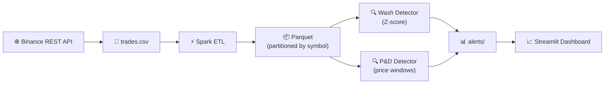
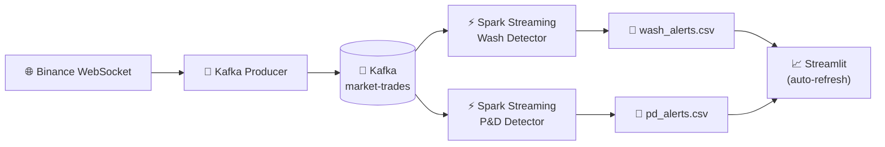
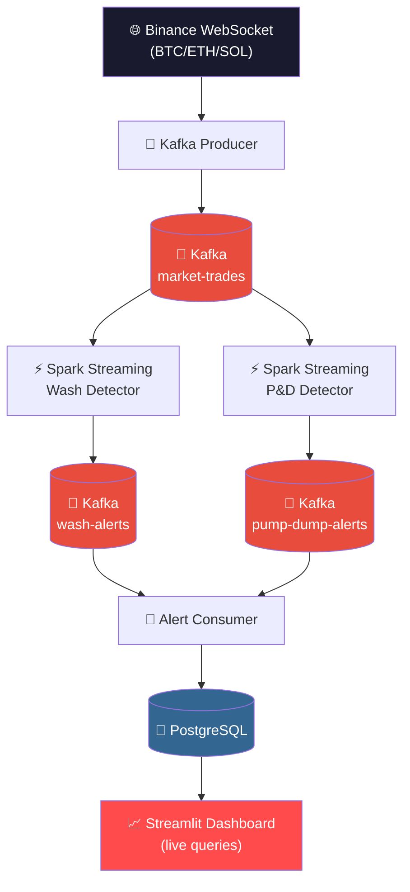
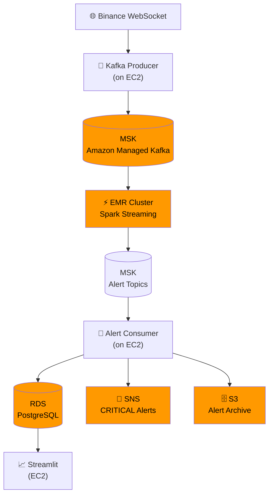
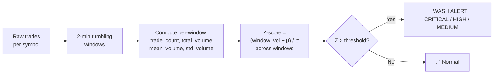
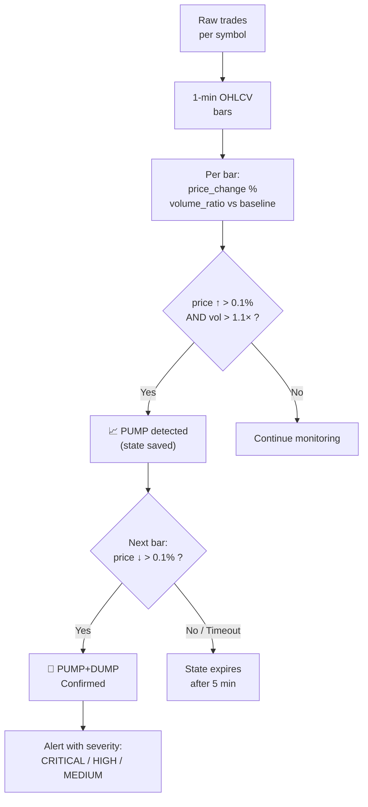
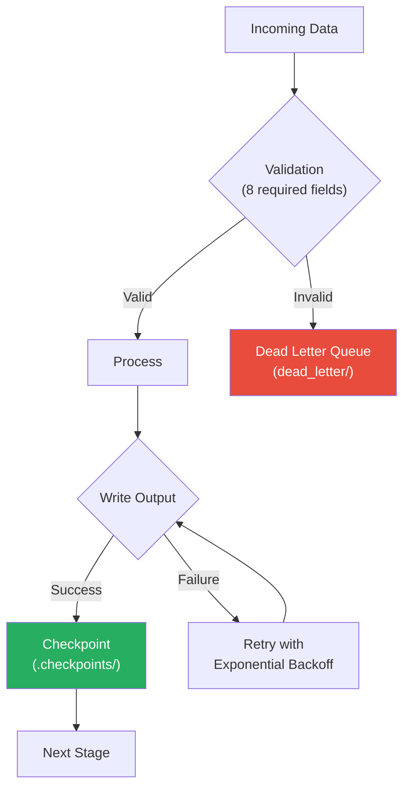

# Market Surveillance for Trade Abuse Detection

A **real-time market surveillance pipeline** that detects manipulative trading patterns — **wash trading** and **pump & dump** schemes — in live cryptocurrency trade data from **Binance**. Built with **Apache Spark**, **Kafka**, **PostgreSQL**, and **Streamlit**.

> Processes **10,000+ trades per minute** from Binance WebSocket, runs statistical detection algorithms via Spark Structured Streaming, persists alerts to PostgreSQL, and surfaces them on a live-updating dashboard.

[](https://python.org)
[](https://spark.apache.org)
[](https://kafka.apache.org)
[](https://postgresql.org)
[](https://streamlit.io)
[](LICENSE)

---

## What It Detects

| Abuse Type | Description | Detection Method |
|:---|:---|:---|
| **Wash Trading** | Artificially inflating volume by trading with oneself or colluding parties | Statistical Z-score anomaly detection on trade volume per symbol per time window |
| **Pump & Dump** | Coordinated price inflation followed by rapid sell-off | Sequential pattern detection — PUMP (price spike + volume surge) followed by DUMP (price reversal) |

> **Why not spoofing?** Spoofing detection requires cancelled order data. Binance's public API only exposes executed trades — cancellations are not available without private exchange feeds.

---

## Architecture

The system is designed in **four progressive phases**, each building on the previous:

### Phase 1 — Batch Pipeline

Fetch historical trades → Spark ETL → Parquet → Batch detectors → CSV alerts → Dashboard.



### Phase 2 — Streaming Pipeline (CSV Sinks)

Live WebSocket → Kafka → Spark Structured Streaming → CSV alerts → Dashboard auto-refresh.



### Phase 3 — Production Streaming (Kafka + PostgreSQL)

CSV sinks replaced with Kafka alert topics → PostgreSQL persistence → live dashboard queries.



### Phase 4 — AWS Cloud Deployment

Same codebase as Phase 3 — only infrastructure changes via `config.py`:



| Local (Phase 3) | AWS (Phase 4) |
|:---|:---|
| Docker Kafka (KRaft) | Amazon MSK (3 brokers, 3 AZs) |
| Spark `local[*]` | Amazon EMR (YARN cluster) |
| Docker PostgreSQL | Amazon RDS (PostgreSQL) |
| Local filesystem | Amazon S3 |
| `log.critical()` | Amazon SNS → Email / Slack / PagerDuty |

> **Zero code changes** — set `MODE = "aws"` in `config.py` and update endpoint URLs.

---

## Tech Stack

| Layer | Technology |
|:---|:---|
| **Data Source** | Binance REST API + WebSocket (`aggTrades` — BTCUSDT, ETHUSDT, SOLUSDT) |
| **Stream Processing** | Apache Kafka 3.7 (KRaft, no Zookeeper) |
| **Compute Engine** | Apache Spark (PySpark) — batch ETL + Structured Streaming |
| **Alert Storage** | PostgreSQL 16 (Phase 3+) / CSV (Phase 1–2) |
| **Dashboard** | Streamlit with Plotly charts |
| **Containerisation** | Docker Compose (Kafka + PostgreSQL) |
| **Cloud Ready** | AWS — MSK, EMR, RDS, S3, SNS |
| **Language** | Python 3.10+ |

---

## Project Structure

```
├── config.py                        # Central config — all paths, thresholds, MODE switch
├── run_all_detections.py            # Batch orchestrator: ETL → detectors
├── dashboard.py                     # Batch Streamlit dashboard
├── docker-compose.yml               # Kafka (KRaft) + PostgreSQL 16
├── requirements.txt
│
├── ingestion/
│   ├── fetch_binance.py             # Binance REST API → trades.csv
│   └── generate_trades.py           # Synthetic data generator (dev/testing)
│
├── etl/
│   ├── etl_trades.py                # Spark ETL: CSV → cleaned Parquet
│   └── spark_utils.py               # SparkSession factory + Parquet reader
│
├── detectors/
│   ├── detect_wash_trades.py        # Batch wash trade detector (Z-score)
│   └── detect_pump_dump.py          # Batch pump & dump detector
│
├── streaming/
│   ├── kafka_producer.py            # Binance WebSocket → Kafka
│   ├── spark_streaming_wash.py      # Streaming wash detector (Spark → Kafka)
│   ├── spark_streaming_pump_dump.py # Streaming P&D detector (Spark → Kafka)
│   ├── alert_consumer.py            # Kafka alert topics → PostgreSQL
│   ├── db.py                        # PostgreSQL schema, connections, queries
│   ├── run_streaming_pipeline.py    # Streaming orchestrator
│   └── stream_alerts_dashboard.py   # Live streaming dashboard
│
├── utils/
│   └── fault_tolerance.py           # Retry, validation, safe writes, checkpoints
│
├── tests/
│   └── test_phase3_integration.py   # End-to-end integration tests
│
└── alerts/                          # Alert CSVs (committed for dashboard demo)
```

---

## Getting Started

### Prerequisites

- **Python 3.10+**
- **Java 8 or 11** (required by Spark)
- **Apache Spark / PySpark**
- **Docker Desktop** (for Kafka and PostgreSQL)

### Installation

```bash
git clone https://github.com/RaySatish/Market-Surveillance-for-Trade-Abuse-Detection.git
cd Market-Surveillance-for-Trade-Abuse-Detection

python -m venv .venv
source .venv/bin/activate       # Windows: .venv\Scripts\activate

pip install -r requirements.txt
pip install pyspark
```

### Fetch Trade Data

```bash
# Real data from Binance (last 30 minutes of trades)
python ingestion/fetch_binance.py

# Or: custom time window
python ingestion/fetch_binance.py --minutes 60
```

---

## Running the Pipeline

### Phase 1 — Batch

```bash
# Full pipeline: ETL → wash detection → pump & dump detection
python run_all_detections.py

# Skip ETL, reuse existing Parquet
python run_all_detections.py --skip-etl

# Resume from last checkpoint (after crash)
python run_all_detections.py --resume

# View results
streamlit run dashboard.py
```

### Phase 3 — Production Streaming

```bash
# 1. Start infrastructure
docker compose up -d

# 2. Initialize database schema
python streaming/db.py --init

# 3. Start the full pipeline (Kafka producer + Spark detectors + alert consumer)
python streaming/run_streaming_pipeline.py --mode phase3 --live

# 4. In a new terminal — launch the live dashboard
streamlit run streaming/stream_alerts_dashboard.py
```

The dashboard auto-refreshes every 5 seconds, querying PostgreSQL for the latest alerts.

```bash
# Stop everything
# Ctrl+C in the pipeline terminal, then:
docker compose down
```

---

## Detection Algorithms

### Wash Trading — Statistical Volume Anomaly

Binance's public API does not expose trader identity, so classical wash detection (same buyer = seller) is not possible. Instead, the detector uses **Z-score volume anomaly detection**:



| Severity | Condition |
|:---|:---|
| **CRITICAL** | Z-score significantly above threshold |
| **HIGH** | Z-score moderately above threshold |
| **MEDIUM** | Z-score marginally above threshold |

### Pump & Dump — Sequential Pattern Detection

Detects a **PUMP phase** (price spike + volume surge) followed by a **DUMP phase** (price reversal) within a configurable time window:



---

## Fault Tolerance

Every stage of the pipeline is designed to handle failures gracefully:



| Mechanism | Description |
|:---|:---|
| **Retry + backoff** | All I/O operations retry with exponential backoff on transient failures |
| **Row-level validation** | Every trade is validated (8 required fields); rejects go to dead letter queue |
| **Atomic writes** | Temp file → SHA-256 check → rename (no partial outputs) |
| **Checkpoints** | JSON checkpoints after each stage; supports `--resume` on crash recovery |
| **DB-level dedup** | PostgreSQL `ON CONFLICT DO NOTHING` — idempotent even with at-least-once Kafka delivery |
| **Manual offset commit** | Kafka consumer commits only after successful DB write — no data loss |

---

## Dashboard

### Batch Dashboard

Reads from `trades.csv` and `alerts/` — **no Spark or infrastructure required**. Works immediately after cloning the repo.

- **Alert Overview** — total alerts, breakdown by type and severity
- **Alert Timeline** — alerts over time (1-minute bins)
- **Wash Trade Analysis** — severity distribution, Z-score by symbol
- **Pump & Dump Analysis** — severity distribution, pump vs dump phases
- **Volume Analysis** — buy vs sell volume, volume over time per symbol
- **Symbol Risk Scoreboard** — weighted risk score (CRITICAL×3 + HIGH×2 + MEDIUM×1)

### Streaming Dashboard

Queries PostgreSQL live with **auto-refresh every 5 seconds**. All timestamps displayed in **IST (UTC+5:30)**. Includes sidebar filters for symbol, severity, and time window.

- **Pipeline Status** — live connection indicator
- **Real-Time Metrics** — alert count, wash/P&D split, critical count, symbols flagged
- **Alert Timeline** — color-coded by alert type
- **Alert Tables** — sortable, filterable raw alert data

---

## Configuration

All thresholds and infrastructure settings are centralized in `config.py`:

```python
# Switch deployment mode
MODE = "streaming"    # Options: "local", "local_streaming", "streaming", "aws"

# Detection thresholds
DETECTION = {
    "wash_zscore_threshold": 0.1,     # Z-score cutoff for wash alerts
    "wash_rolling_window":   "2min",  # tumbling window size

    "pd_window_minutes":   5,         # PUMP→DUMP timeout window
    "pd_pump_threshold":   0.001,     # 0.1% price rise = PUMP
    "pd_dump_threshold":  -0.001,     # 0.1% price drop = DUMP
    "pd_volume_ratio":     1.1,       # volume must exceed 1.1× baseline
}
```

> **Tuning note:** These thresholds are calibrated for real Binance data on major crypto pairs (BTC, ETH, SOL) where spreads are tight and volume is stable. Lower thresholds → more alerts (higher recall). Higher thresholds → fewer, more confident alerts.

---

## License

MIT License — see [LICENSE](LICENSE)
